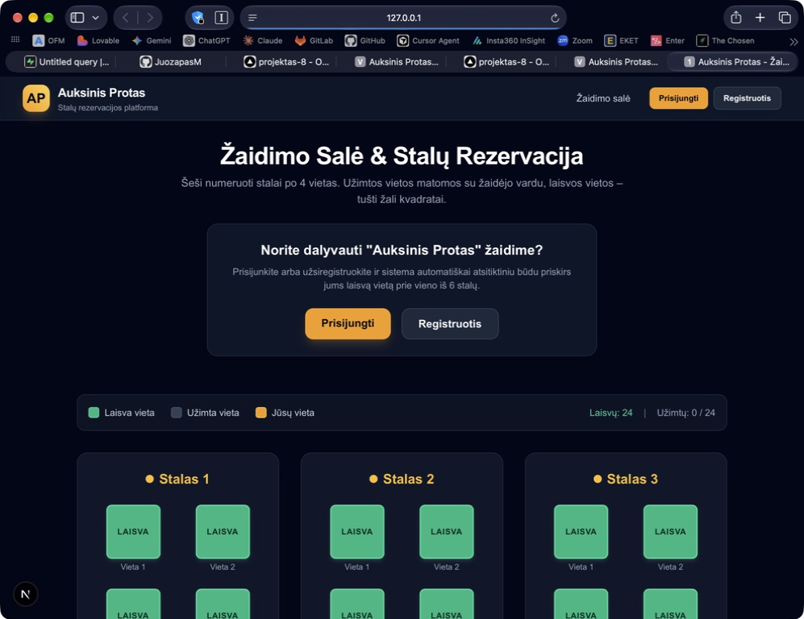
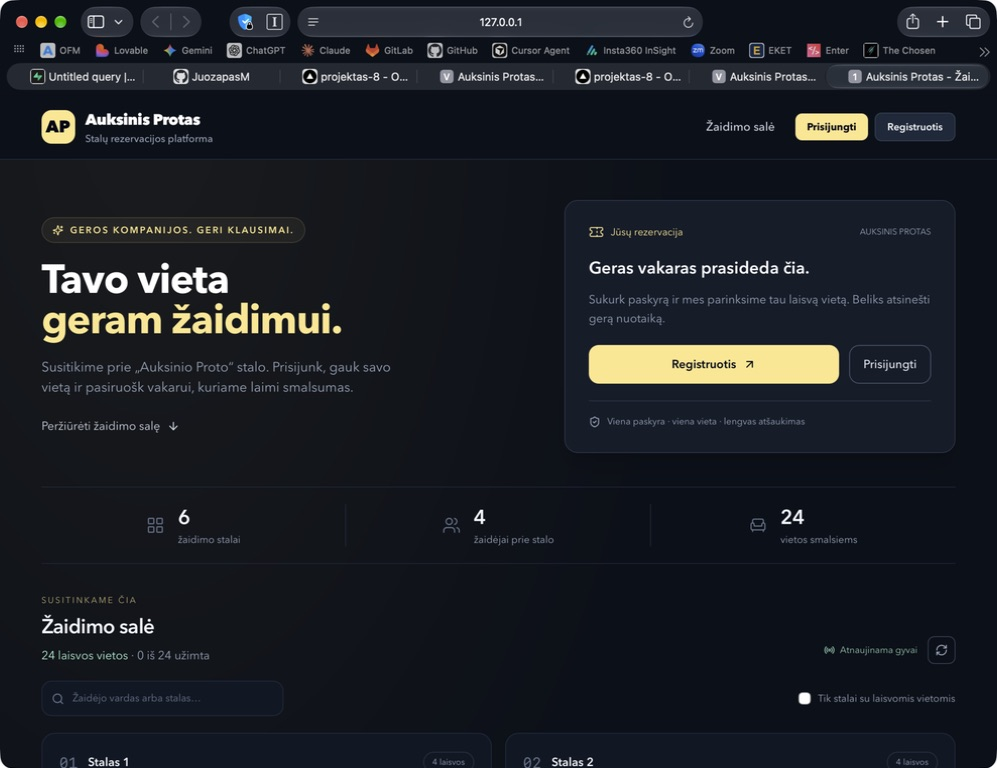
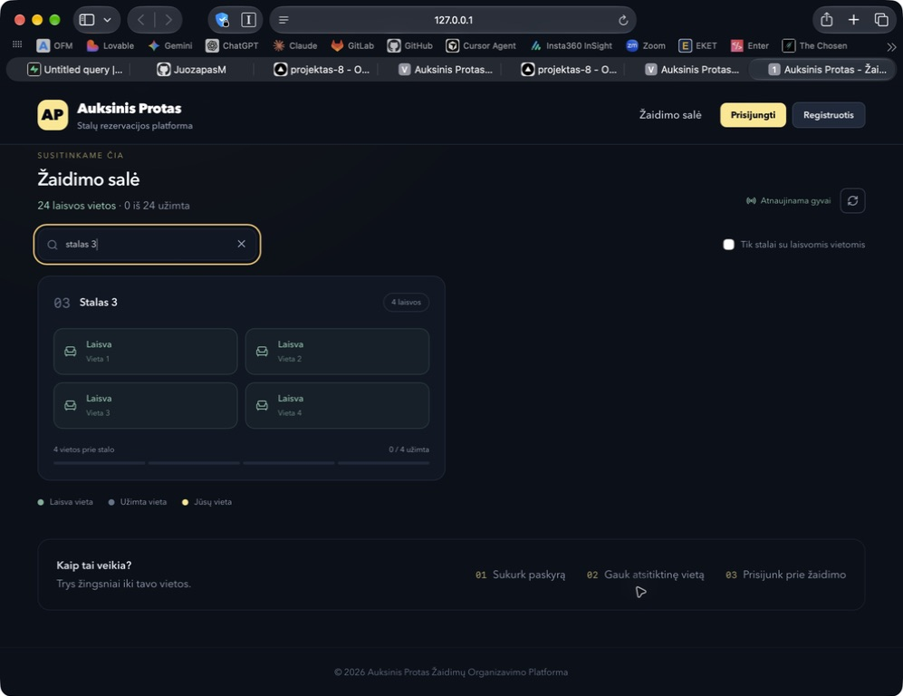
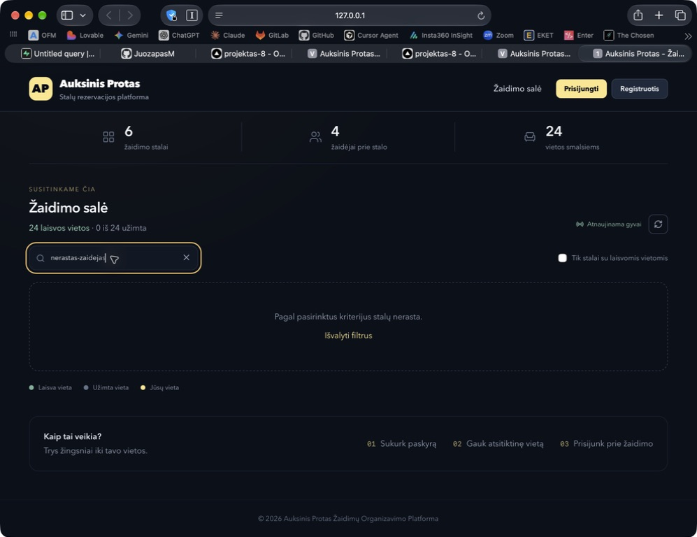
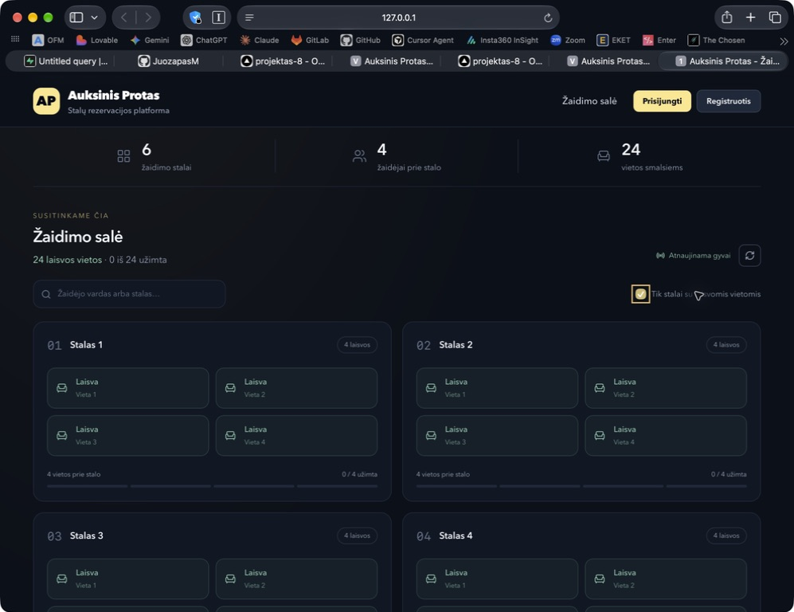
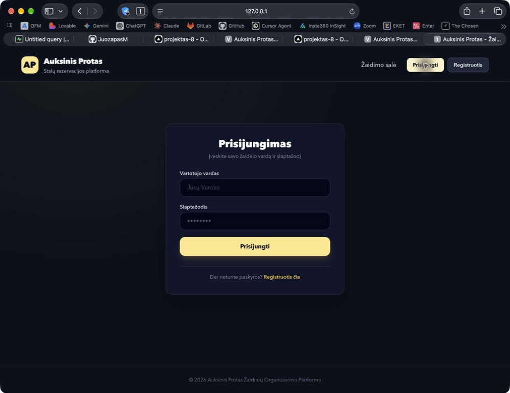
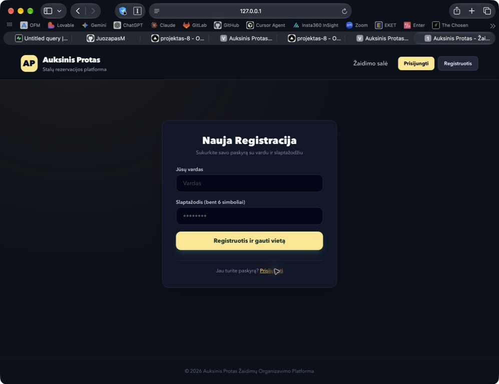

# „Auksinis Protas“ puslapio peržiūra

2026-09-13. Peržiūrėtas vietinis Next.js projektas Safari naršyklėje. Išlaikytas tamsus ir auksinis stilius, pakeistas pagrindinio puslapio išdėstymas, stalų ir vietų kortelės. Ekrano nuotraukos išsaugotos ir vizualiai patikrintos. Peržiūra atlikta neprisijungus prie žaidėjo paskyros.

## 1. Pagrindinis puslapis — tvarkingas

Prieš pakeitimus ryškūs žali vietų kvadratai dominavo, viršutinėje dalyje kartojosi prisijungimo mygtukai ir informacija. Dabar antraštė ir rezervacija sudaro aiškias atskiras sritis, žemiau pateikiama salės talpa ir salės planas. Išsaugota atpažįstama AP žyma.

## 2. Stalų ir žaidėjų paieška — veikia

Įvedus „stalas 3“, matomas tik trečias stalas. Paieška taip pat ieško žaidėjų vardų; realių užimtų vietų su žaidėjais šioje peržiūroje nebuvo. Vietos turi aiškų tekstą ir ikoną; laisvos vietos nebeatrodo kaip paspaudžiami mygtukai. Rezervacija išlieka atsitiktinė.

## 3. Tuščias paieškos rezultatas — veikia

Nerasta užklausa rodo paaiškinimą ir mygtuką „Išvalyti filtrus“. Paspaudus mygtuką visi šeši stalai vėl matomi. Įvesties klaviatūros fokusas aiškiai išskiriamas.

## 4. Laisvų stalų filtras ir atnaujinimas — veikia

Galima palikti tik stalus, prie kurių yra laisvų vietų. Patikrintas filtro įjungimas; šiuo metu visi stalai buvo laisvi. Rankinis atnaujinimas trumpam išjungia mygtuką ir sėkmingai grąžina duomenis. Rodoma faktinė Realtime prenumeratos būsena. Gyvi pasikeitimai atnaujina ir vartotojo rezervacijos informaciją serverio pusėje.

## 5. Prisijungimas — forma tvarkinga, paskyros prisijungimas nebandytas

Nuoroda atidaro prisijungimo formą. Laukų etiketės susietos su įvestimis, įjungti tinkami automatinio užpildymo atributai. Serverio veiksmų testai tikrina klaidų apdorojimą ir senų paskyrų vardų atitikimą.

## 6. Registracija — forma tvarkinga, reali paskyra nekurta

Registracijos nuoroda ir grįžimas į prisijungimą veikia. Vardas tikrinamas serverio pusėje, leidžiamos lietuviškos raidės. Vidinis autentifikacijos identifikatorius išsaugo skirtingų vardų atskyrimą ir neviršija el. pašto vietinės dalies ilgio. Registracijos metu administratoriaus vaidmuo nebesuteikiamas pagal vardą. Nepavykus rezervuoti vietos, sėkmingai sukurta paskyra išlaikoma ir rodomas pranešimas.

## Kodo ir saugumo pataisos

- SQL rezervavimo ir atšaukimo funkcijos tikrina `auth.uid()` ir leidžia keisti tik savo vietą; administratoriaus RPC atskirai tikrina vaidmenį. `SECURITY DEFINER` funkcijoms nustatytas tuščias `search_path`, atšaukta anoniminė vykdymo teisė. Tai atitinka [Supabase funkcijų saugumo gaires](https://supabase.com/docs/guides/database/functions).
- Panaikintas automatinis administratoriaus teisių suteikimas pagal vardą „Juozapas“. RLS nebeleidžia savo profilio įterpti su administratoriaus vaidmeniu. Istoriją gali skaityti tik administratorius.
- To paties žaidėjo rezervacijos operacijos užrakina profilio eilutę. Laisvos vietos parenkamos su `FOR UPDATE SKIP LOCKED`.
- Administratoriams skirtas turinys papildomai apsaugotas serverio išdėstyme, o middleware klaidos nebepraleidžia užklausos į administratoriaus puslapį. Peradresuojant išsaugomi atnaujinti seanso slapukai.
- Pataisytas Supabase aplinkos kintamųjų tikrinimas. Naršyklė ir serveris naudoja tuos pačius viešus kintamuosius. Kai konfigūracija neteisinga arba bazė neprieinama, pavyzdinės vietos neberodomos kaip tikrai laisvos ir rezervacija išjungiama.
- API klaidos apdorojamos žaidėjo ir administratoriaus valdikliuose. Atšaukimas turi patvirtinimo žingsnį. Pridėta nuoroda klaviatūros naudotojams pereiti prie turinio ir sumažinto judesio palaikymas.
- Sutvarkyta ESLint komanda ir pridėtos priklausomybės bei 7 automatiniai testai. Next.js vidinė PostCSS priklausomybė pakeista į suderinamą 8.5.28 versiją.
- `.env.local.example` buvę tikri raktai pakeisti pavyzdinėmis reikšmėmis.

## Patikrų rezultatai

| Patikra | Rezultatas |
| --- | --- |
| `npm run lint` | Praėjo |
| `npm run typecheck` | Praėjo |
| `npm test` | 7 iš 7 praėjo |
| `npm run build` | Praėjo |
| `npm audit` | 0 aptiktų pažeidžiamumų po PostCSS atnaujinimo |
| Vieši HTTP maršrutai ir administratoriaus apsauga | Vieši puslapiai 200; `/admin` ir `/admin/history` neprisijungus grąžina 307 į prisijungimą |
| SQL schema ir migracija vietinėje PGlite bazėje | Praėjo; migracija patikrinta ir pakartotinai |

SQL testai tikrina tiesioginį anoniminį RPC, kito žaidėjo rezervacijos keitimą, administratoriaus veiksmus be teisių, neteisėtą administratoriaus profilio įterpimą, istorijos prieigą, rezervavimą, pakartotinį rezervavimą, atšaukimą, administratoriaus vietos atlaisvinimą ir pilnos salės būseną. PGlite testuose `uuid-ossp` pakeičiamas PostgreSQL `gen_random_uuid()`.

## Reikalingi diegimo veiksmai

1. Esamai Supabase bazei SQL Editor paleisti `supabase/migrations/20260913_reservation_security.sql`. Šioje peržiūroje nuotolinėje bazėje migracija nevykdyta.
2. Peržiūrėti esamus administratorių vaidmenis. Migracija jų neatšaukia; ji užkerta kelią tolesniam automatiniam suteikimui.
3. Pakeisti `.env.local.example` buvusį `service_role` raktą Supabase nustatymuose, jei failas buvo bendrintas ar įkeltas į Git. Rakto pašalinimas iš naujos versijos nepanaikina jo Git istorijoje. Programai šio rakto nereikia.
4. Registracijai vardu reikalingas išjungtas Supabase Email „Confirm email“, nes tikras el. paštas nerenkamas. Norint patvirtinimo ar slaptažodžio atkūrimo, registraciją reikia išplėsti tikro el. pašto lauku.

## Siūlomos naujos funkcijos

| Prioritetas | Funkcija | Nauda |
| --- | --- | --- |
| 1 | Renginių kalendorius ir atskiros renginių rezervacijos | Rezervuojama konkrečiam vakarui, aiškiai matoma data, laikas ir vieta |
| 2 | Laukiančiųjų eilė | Pilna salė nepalieka norinčių dalyvauti be kito žingsnio; atlaisvinta vieta pasiūloma kitam |
| 3 | Komandos registracija ir pakvietimo nuoroda | Draugai gali registruotis kartu; reikia numatyti grupinių rezervacijų taisykles |
| 4 | Tikras el. paštas ir slaptažodžio atkūrimas | Žaidėjai savarankiškai atkuria prieigą ir gali gauti priminimus |
| 5 | QR registracija atvykus | Organizatorius greitai pažymi atvykusius žaidėjus |
| 6 | Rezultatų lentelė ir ankstesnių žaidimų istorija | Dalyviai turi priežastį grįžti į platformą po žaidimo |

Paieška, laisvų stalų filtras, rankinis atnaujinimas, ryšio indikatorius ir atšaukimo patvirtinimas jau įgyvendinti. Lentelėje pateiktos funkcijos yra pasiūlymai.

## Peržiūros ribos

Neatlikta reali naujos paskyros registracija, prisijungusio žaidėjo ar administratoriaus vizualinė peržiūra, kelių tikrų naudotojų Realtime pakeitimų testas ar lygiagrečios operacijos tarp kelių PostgreSQL jungčių. Mobilus išdėstymas turi adaptyvias CSS taisykles, bet konkretaus telefono dydžio naršyklės peržiūra neatlikta. Ekrano nuotraukos ir kodo patikra nepatvirtina visos WCAG atitikties; lieka ekrano skaitytuvo, kontrasto ir mobilių įrenginių patikros.
